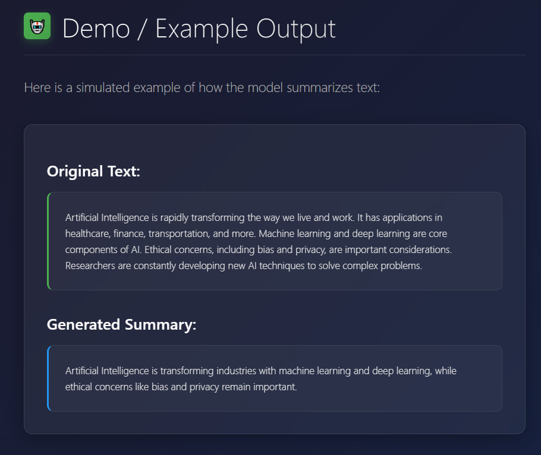

# 📝 T5 CNN/DailyMail Summarization

> Fine-tuning the **T5-small** model on the CNN/DailyMail dataset for **text summarization** using Hugging Face Transformers.  
> Automatically generate concise news summaries with state-of-the-art Transformers ⚡

---

## 🚀 Features
- ✅ Preprocessing and tokenization of the dataset
- ✅ Fine-tuning T5-small using `Seq2SeqTrainer`
- ✅ Evaluation with **ROUGE** metrics
- ✅ Inference function to generate summaries from any text
- ✅ GPU-friendly (supports mixed precision for faster training)

---

## 🗂 Project Structure

```

t5-cnn-dailymail-summarization/
│
├── .gitignore
├── requirements.txt
├── README.md
└── src/
├── train.py       # Sets up Trainer and trains the model
├── inference.py   # Generates summaries / inference
└── config.py      # Stores training\_args and fixed parameters

```

---

## ⚙️ Installation 🛠️

Follow these steps to set up the project:

```bash
# 1️⃣ Clone the repository
git clone https://github.com/<YOUR_USERNAME>/t5-cnn-dailymail-summarization.git
cd t5-cnn-dailymail-summarization

# 2️⃣ Install dependencies
pip install -r requirements.txt


````


## 🏋️ Training

* `train.py` fine-tunes the T5 model and saves outputs to `OUTPUT_DIR`.
* All parameters and paths are configurable in `src/config.py`.

```bash
python src/train.py
```

---

## 📊 Evaluation

* During training, the model is evaluated using **ROUGE scores**.
* ROUGE-1, ROUGE-2, and ROUGE-L metrics are computed and displayed automatically.

---

## 🤖 Inference

* Generate summaries using the trained model:

```bash
python src/inference.py
```

* Example usage inside `inference.py`:

```python
from src.inference import generate_summary

text = "The Apollo program was the third United States human spaceflight program..."
summary = generate_summary(text)
print(summary)
```

---

## 📌 Requirements

* Python >= 3.9
* PyTorch >= 2.0
* transformers >= 4.30
* datasets >= 2.13
* evaluate >= 0.4
* numpy, pandas, scikit-learn, tqdm, accelerate

---


## 🖼️ Demo / Screenshot

Here is an example of T5 generating a concise summary from a news article:




---


